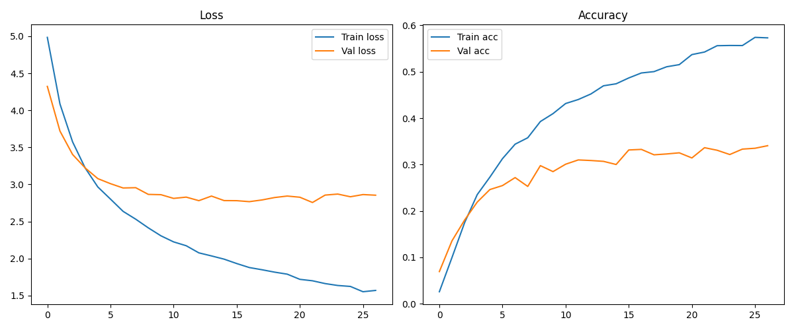
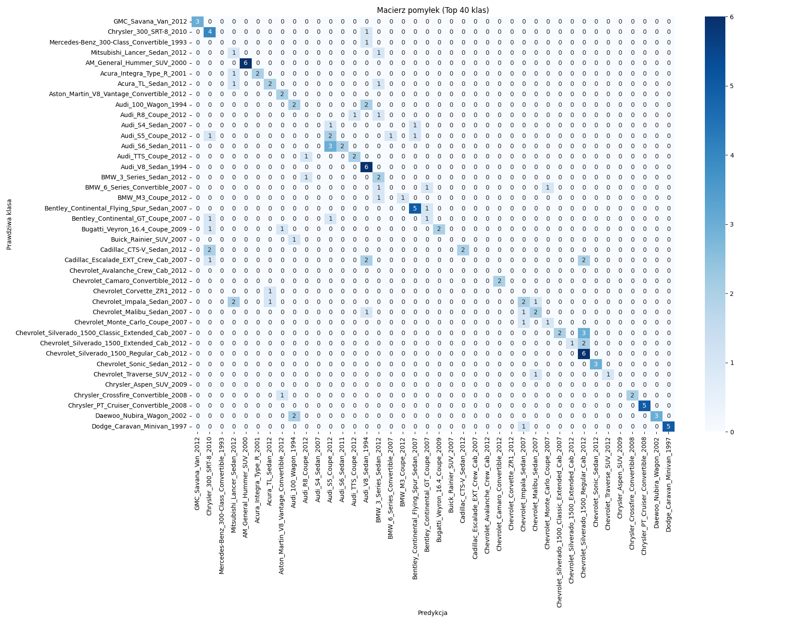
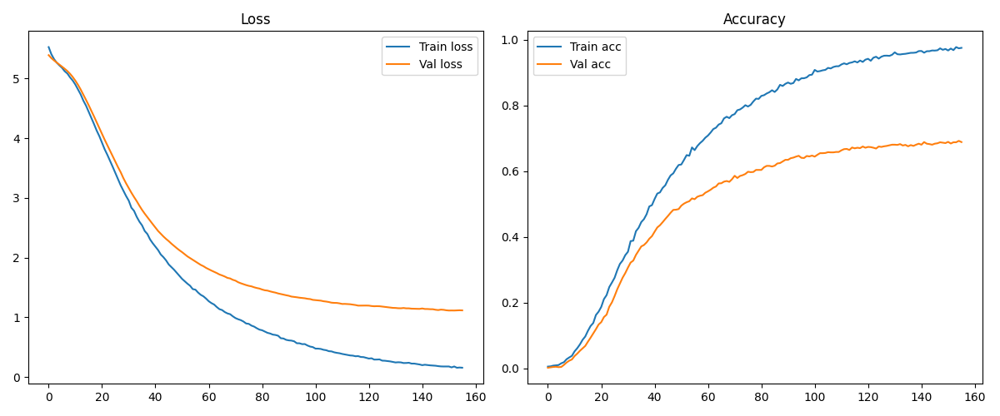

# Projekt zaliczeniowy: Inteligencja Obliczeniowa

## Etapy pracy

1. Rozpocząłem od poszukiwań zadowalającego mnie zbioru danych – wybrałem Stanford Cars Dataset, który zawiera 196 klas pojazdów.  
2. Napisałem program do przygotowania danych pod uczenie:  
   - Pliki z `.mat` parsuję za pomocą biblioteki `scipy.io`
   - Dane zostały podzielone na 2 zbiory - treningowy i testowy z pomocą biblioteki `train_test_split` z `sklearn`
   - Obrazy umieściłem w folderach zgodnie z wymganiami `ImageDataGenerator`
3. Zbudowałem pierwszy model do klasyfikacji zdjęć:
   - Zdecydowałem się na  transfer learning `MobileNetV2`
   - Ustawiłem `batch_size=32` a `liczbę epok = 50`
   - W celu uniknięcia przeuczenia dodałem `EarlyStopping` i`ModelCheckpoint`
> model ten osiągnął dokładność walidacyjną ~30%, nie jest to wynik oczekiwany lecz nie najgorszy jak na pierwsze trenowanie. Early stopping pomogło uniknąć przetrenowania zatrzymując je na 27 epoce. Na własnych zdjęciach skuteczność rozpoznania wyniosła około 33%.

4. Przy drugim podejściu w `ImageDataGenerator` zmieniłem `roatation_range=15` (z 20) i dodałem `shear_range=0.1` oraz `brightness_range=(0.7, 1.3)`. Miało to na celu poprawić wyniki w przypadku bardziej "naturalnych zdjęć". Skuteczność rozpoznawania wyniosła ~34%. Jest to nieznaczna poprawa.

5. Podczas trzeciego podejścia, postanowiłem zmienić batch size do 64, dało to najoptymalniejszy wynik do tej pory - val accuracy wynosiło 37%. Dalsze zwiększanie batch size nie poprawiało wyniku.

6. Po odblokowaniu górnych warstw MobileNetV2 (fine tuning) i zwiększeniu gęstości sieci dwukrotnie (512 neuronów), val accuracy skoczyło na 69%. Jest to znacząca poprawa względem poprzedniej próby.

> Model osiągnął **69% dokładności walidacyjnej** przy 196 klasach, co jest bardzo dobrym wynikiem biorąc pod uwagę zróżnicowanie i ilość danych (~6,5 tys. obrazów). Krzywe trenowania sugerują, że model nadal może zyskać na dalszym tuningu.

---

## Wyniki

### Wykres strat i dokładności dla pierwszego modelu 30%



### Macierz pomyłek dla pierwszego modelu 30% (Top 40 klas)



### Wykres strat i dokładności dla 69%



### Macierz pomyłek dla 69% (Top 40 klas)


---

## O modelu i metrykach

- **MobileNetV2** to lekka, szybka sieć CNN stworzona do klasyfikacji obrazów. Skorzystałem z **transfer learningu**, bazując na wagach z ImageNet.
- Do ostatnich warstw dodałem własną część: `GlobalAveragePooling2D`, `Dropout`, `Dense`, `softmax`.
- **Metryka**: `val accuracy` (dokładność na zbiorze walidacyjnym).
- **Loss**: `categorical_crossentropy` – ponieważ to klasyfikacja wieloklasowa.

---

## Możliwe usprawnienia (TODO)

- Wypróbować inne architektury (np. EfficientNet, ResNet)
- Zwiększyć fragment bazy modelu dostępny do trenowania (więcej odblokowanych warstw)
- Lepszy balans klas (niektóre mają mało zdjęć)
- Augmentacja rzadkich klas
- Praca na większej rozdzielczości (np. 299x299)

---

## Źródło danych

Zbiór danych pochodzi z pracy:

> Krause, J., Stark, M., Deng, J., & Fei-Fei, L. (2013).  
> *3D Object Representations for Fine-Grained Categorization*.  
> In Proceedings of the IEEE International Conference on Computer Vision Workshops (pp. 554–561).

BibTeX:
```bibtex
@inproceedings{krause20133d,
  title={3D Object Representations for Fine-Grained Categorization},
  author={Krause, Jonathan and Stark, Michael and Deng, Jia and Fei-Fei, Li},
  booktitle={Proceedings of the IEEE International Conference on Computer Vision Workshops},
  pages={554--561},
  year={2013}
}
