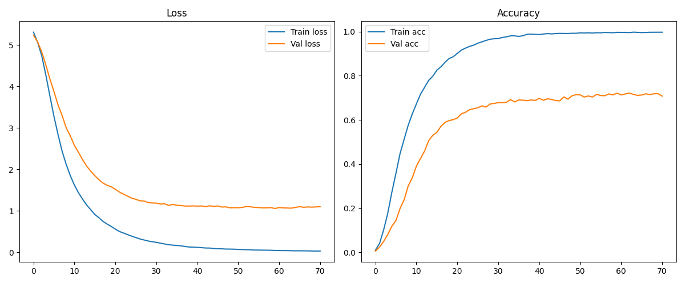
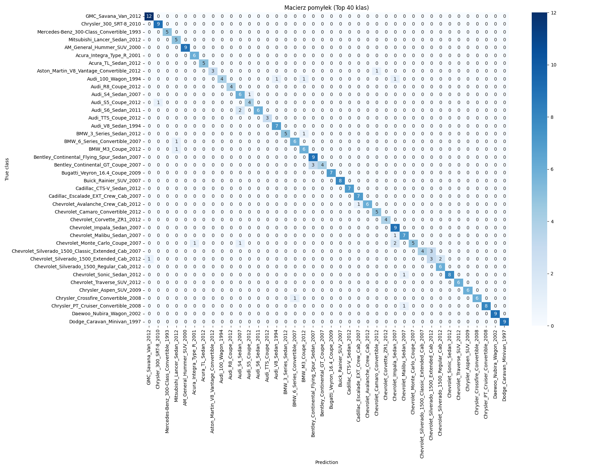

# Projekt zaliczeniowy: Inteligencja Obliczeniowa

## Założenia projektu

Założeniami projektu, było wytrenowanie modelu inteligencji obliczeniowej, zdolnego do rozpozania modelu samochodu z dokładnością przynajmniej 75%.

---

## Praktyczne zastosowanie

Model może być użyty jako:
- system rozpoznawania modeli samochodów np. w aplikacji mobilnej
- element systemów inteligentnych parkingów
- pomoc dla firm ubezpieczeniowych przy weryfikacji pojazdów
- policyjne bazy danych

---

## Etapy pracy

1. Rozpocząłem od poszukiwań zadowalającego mnie zbioru danych – wybrałem Stanford Cars Dataset, który zawiera 196 klas pojazdów.
2. Napisałem program do przygotowania danych pod uczenie:
   - Pliki `.mat` parsuję za pomocą biblioteki `scipy.io`
   - Dane zostały podzielone na 2 zbiory – treningowy i testowy – z pomocą funkcji `train_test_split` z `sklearn`
   - Obrazy umieściłem w folderach zgodnie z wymaganiami `ImageDataGenerator`
3. Zbudowałem pierwszy model do klasyfikacji zdjęć:

   - Zdecydowałem się na transfer learning z użyciem `MobileNetV2`
   - Ustawiłem `batch_size=32` oraz `liczbę epok = 50`
   - W celu uniknięcia przeuczenia dodałem `EarlyStopping` i `ModelCheckpoint`
     > Model ten osiągnął dokładność walidacyjną ~30%. Nie jest to wynik oczekiwany, lecz nie najgorszy jak na pierwsze trenowanie. Early stopping pomogło uniknąć przetrenowania, zatrzymując trening na 27. epoce. Na własnych zdjęciach skuteczność rozpoznania wyniosła około 33%.

4. Przy drugim podejściu w `ImageDataGenerator` zmieniłem `rotation_range=15` (z 20) i dodałem `shear_range=0.1` oraz `brightness_range=(0.7, 1.3)`. Miało to na celu poprawę wyników w przypadku bardziej "naturalnych" zdjęć. Skuteczność rozpoznawania wyniosła ~34%. Jest to nieznaczna poprawa.

5. Podczas trzeciego podejścia postanowiłem zwiększyć `batch_size` do 64. Dało to najoptymalniejszy wynik do tej pory – val accuracy wynosiło 37%. Dalsze zwiększanie `batch_size` nie poprawiało wyników.

6. Po odblokowaniu górnych warstw MobileNetV2 (fine-tuning) i zwiększeniu liczby neuronów dwukrotnie (do 512), val accuracy skoczyło na 69%. Jest to znacząca poprawa względem poprzedniej próby.

> Model osiągnął **69% dokładności walidacyjnej** przy 196 klasach, co jest bardzo dobrym wynikiem, biorąc pod uwagę zróżnicowanie i liczbę danych (~6,5 tys. obrazów). Krzywe trenowania sugerują, że model nadal może zyskać na dalszym tuningu.

7. W kolejnych dwóch podejściach postawowiłem nieznacznie zmienić parametry. Zwiększyłem liczbę neuronów do 1024, oraz img size do 240. oprócz tego w ostatnim podejściu zwiększyłem patience do 11 i optimizer Adam do 3e-5 usuwając przy tym Dropout. Oba podejścia osiągnęły **skuteczność na poziomie 72%**. Ze względu na ograniczenia sprzętowe GPU, kolejne próby nie będą przeprowadzane.

8. Do ostatniej próby użyłem algorytmu **EfficientNetV3**. Niestety ze względu na ograniczenia srzętowe nie byłem zbytnio w stanie zmienić parametrów i wynik końcowy okazał się być taki sam.

---

## Wnioski
Model osiągnął 72% skuteczności, co jest wynikiem bliskim założeniom. Potwierdza to fakt, że przy umiejętnym dobraniu parametrów uczenia i mocnym sprzęcie, da się wytrenować model zdolny do rozpoznawania modeli samochodów z dokładnością powyżej 75%.
---

## Wyniki

### Wykres strat i dokładności dla pierwszego modelu (30%)


### Macierz pomyłek dla pierwszego modelu (30%) – Top 40 klas


### Wykres strat i dokładności dla modelu z 72%



### Macierz pomyłek dla modelu z 72% – Top 40 klas



---

## Środowisko

Model trenowano na:
- Python 3.12
- TensorFlow 2.19 (CPU/GPU)
- Keras (zintegrowany z TF)
- Scikit-learn, NumPy, Pillow

Sprzęt:
- NVIDIA RTX 3070, 8 GB VRAM
- RAM: 32 GB

---

## Źródło danych

Zbiór danych pochodzi z pracy:

> Krause, J., Stark, M., Deng, J., & Fei-Fei, L. (2013).  
> _3D Object Representations for Fine-Grained Categorization_.  
> In Proceedings of the IEEE International Conference on Computer Vision Workshops (pp. 554–561).

BibTeX:

```bibtex
@inproceedings{krause20133d,
  title={3D Object Representations for Fine-Grained Categorization},
  author={Krause, Jonathan and Stark, Michael and Deng, Jia and Fei-Fei, Li},
  booktitle={Proceedings of the IEEE International Conference on Computer Vision Workshops},
  pages={554--561},
  year={2013}
}
```
