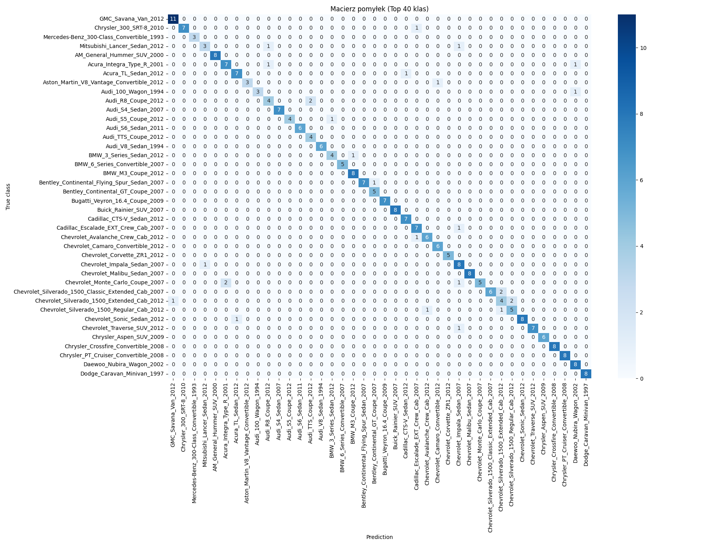

# Projekt zaliczeniowy: Inteligencja Obliczeniowa

## Etapy pracy

1. Rozpocząłem od poszukiwań zadowalającego mnie zbioru danych – wybrałem Stanford Cars Dataset, który zawiera 196 klas pojazdów.
2. Napisałem program do przygotowania danych pod uczenie:
   - Pliki `.mat` parsuję za pomocą biblioteki `scipy.io`
   - Dane zostały podzielone na 2 zbiory – treningowy i testowy – z pomocą funkcji `train_test_split` z `sklearn`
   - Obrazy umieściłem w folderach zgodnie z wymaganiami `ImageDataGenerator`
3. Zbudowałem pierwszy model do klasyfikacji zdjęć:

   - Zdecydowałem się na transfer learning z użyciem `MobileNetV2`
   - Ustawiłem `batch_size=32` oraz `liczbę epok = 50`
   - W celu uniknięcia przeuczenia dodałem `EarlyStopping` i `ModelCheckpoint`
     > Model ten osiągnął dokładność walidacyjną ~30%. Nie jest to wynik oczekiwany, lecz nie najgorszy jak na pierwsze trenowanie. Early stopping pomogło uniknąć przetrenowania, zatrzymując trening na 27. epoce. Na własnych zdjęciach skuteczność rozpoznania wyniosła około 33%.

4. Przy drugim podejściu w `ImageDataGenerator` zmieniłem `rotation_range=15` (z 20) i dodałem `shear_range=0.1` oraz `brightness_range=(0.7, 1.3)`. Miało to na celu poprawę wyników w przypadku bardziej "naturalnych" zdjęć. Skuteczność rozpoznawania wyniosła ~34%. Jest to nieznaczna poprawa.

5. Podczas trzeciego podejścia postanowiłem zwiększyć `batch_size` do 64. Dało to najoptymalniejszy wynik do tej pory – val accuracy wynosiło 37%. Dalsze zwiększanie `batch_size` nie poprawiało wyników.

6. Po odblokowaniu górnych warstw MobileNetV2 (fine-tuning) i zwiększeniu liczby neuronów w gęstej warstwie dwukrotnie (do 512), val accuracy skoczyło na 69%. Jest to znacząca poprawa względem poprzedniej próby.

> Model osiągnął **69% dokładności walidacyjnej** przy 196 klasach, co jest bardzo dobrym wynikiem, biorąc pod uwagę zróżnicowanie i liczbę danych (~6,5 tys. obrazów). Krzywe trenowania sugerują, że model nadal może zyskać na dalszym tuningu.

---

## Wyniki

### Wykres strat i dokładności dla pierwszego modelu (30%)


### Macierz pomyłek dla pierwszego modelu (30%) – Top 40 klas


### Wykres strat i dokładności dla modelu z 69%


### Macierz pomyłek dla modelu z 69% – Top 40 klas



---

## O modelu i metrykach

- **MobileNetV2** to lekka, szybka sieć CNN zaprojektowana do klasyfikacji obrazów. Skorzystałem z **transfer learningu**, bazując na wagach wytrenowanych na ImageNet.
- Do końcówki modelu dodałem własne warstwy: `GlobalAveragePooling2D`, `Dropout`, `Dense`, `softmax`.
- **Metryka**: `val accuracy` (dokładność na zbiorze walidacyjnym).
- **Loss**: `categorical_crossentropy` – odpowiednia dla klasyfikacji wieloklasowej.

---

## Możliwe usprawnienia (TODO)

- Wypróbować inne architektury (np. EfficientNet, ResNet)
- Zwiększyć liczbę odblokowanych warstw w bazowym modelu (fine-tuning)
- Poprawić balans klas (niektóre mają mało zdjęć)
- Zastosować augmentację tylko dla rzadkich klas
- Trenować na większej rozdzielczości (np. 299x299)

---

## Źródło danych

Zbiór danych pochodzi z pracy:

> Krause, J., Stark, M., Deng, J., & Fei-Fei, L. (2013).  
> _3D Object Representations for Fine-Grained Categorization_.  
> In Proceedings of the IEEE International Conference on Computer Vision Workshops (pp. 554–561).

BibTeX:

```bibtex
@inproceedings{krause20133d,
  title={3D Object Representations for Fine-Grained Categorization},
  author={Krause, Jonathan and Stark, Michael and Deng, Jia and Fei-Fei, Li},
  booktitle={Proceedings of the IEEE International Conference on Computer Vision Workshops},
  pages={554--561},
  year={2013}
}
```
